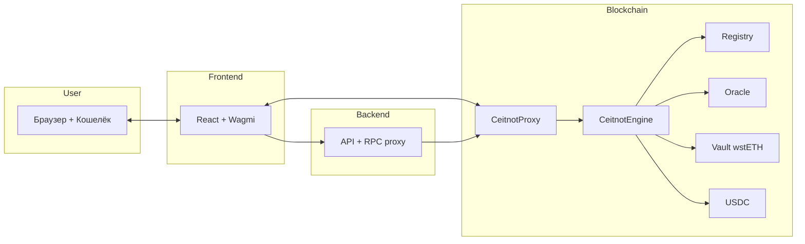

# Архитектура проекта Ceitnot

Краткое описание для новичка: **Ceitnot** — это протокол займов под залог (lending). Пользователь вносит коллатерал (например wstETH), получает право занимать стейблкоин (в CDP-режиме — **aUSD**). Цена коллатерала берётся из оракула; логику движка можно обновлять через прокси. Имена контрактов в коде — **`CeitnotEngine`**, **`CeitnotProxy`** и т.д.; см. [BRANDING-AND-NAMING.md](BRANDING-AND-NAMING.md).

---

## 1. Общая картина: кто с кем общается

```
┌─────────────────────────────────────────────────────────────────────────────┐
│                              ПОЛЬЗОВАТЕЛЬ                                    │
│                    (браузер + кошелёк MetaMask/Rabby)                         │
└─────────────────────────────────────────────────────────────────────────────┘
                    │
                    │ 1. Открывает сайт, подключает кошелёк
                    ▼
┌─────────────────────────────────────────────────────────────────────────────┐
│                           ФРОНТЕНД (React)                                   │
│  • Показывает балансы, позицию, кнопки Deposit / Borrow / Repay              │
│  • Читает данные с блокчейна (через wagmi) и с бэкенда (config, stats)       │
│  • Отправляет транзакции в кошелёк → пользователь подписывает                │
└─────────────────────────────────────────────────────────────────────────────┘
                    │                              │
                    │ 2. Запросы API               │ 3. RPC (чтение/транзакции)
                    ▼                              ▼
┌──────────────────────────────┐    ┌────────────────────────────────────────┐
│        БЭКЕНД (Node.js)      │    │           БЛОКЧЕЙН (Arbitrum)            │
│  • /api/config/contracts     │    │  Контракты: Proxy, Engine, Registry,     │
│  • /api/stats/:chainId       │    │  Oracle, Vault (wstETH), USDC            │
│  • /api/rpc/42161 (прокси)   │    │  Пользователь вызывает методы контрактов │
│  • /api/faucet (для Anvil)   │    │  через кошелёк                           │
└──────────────────────────────┘    └────────────────────────────────────────┘
```

**Почему так:** фронт не хранит секреты и не подписывает транзакции — это делает кошелёк. Бэкенд даёт адреса контрактов и, при необходимости, проксирует RPC (чтобы не было CORS). Вся логика денег и залогов живёт в смарт-контрактах на блокчейне.

---

## 2. Слои проекта (папки и роли)

| Слой        | Папка / файлы        | За что отвечает |
|------------|----------------------|------------------|
| **Контракты** | `src/*.sol`, `script/` | Логика протокола: депозит коллатерала, займ, погашение, оракул, апгрейд. |
| **Бэкенд**   | `backend/src/`        | API для фронта: конфиг (адрес движка), статистика, прокси RPC, кран для теста. |
| **Фронтенд** | `frontend/src/`       | Интерфейс: подключение кошелька, формы, отображение позиции и комиссий. |

---

## 3. Смарт-контракты (блокчейн)

### 3.1. Схема зависимостей контрактов

```
                    ┌─────────────────┐
                    │   `CeitnotProxy`   │  ← Прокси движка Ceitnot: адрес знает фронт и бэкенд
                    │ (прокси UUPS)   │     Все вызовы идут сюда.
                    └────────┬────────┘
                             │ delegatecall
                             ▼
                    ┌─────────────────┐
                    │  `CeitnotEngine`   │  ← Реализация: депозит, займ, repay,
                    │ (implementation)│     ликвидации, harvest, пауза, апгрейд
                    └────────┬────────┘
                             │
         ┌───────────────────┼───────────────────┐
         ▼                   ▼                    ▼
┌──────────────────────┐ ┌─────────────────┐ ┌─────────────────┐
│ CeitnotMarketRegistry   │ │  OracleRelay    │ │  ERC-4626 Vault │
│ (список рынков)      │ │ (цена коллатерала)│ │ (например wstETH)│
│ marketId → vault…    │ │ Chainlink +      │ │ shares ↔ assets │
│ LTV, caps            │ │ fallback         │ │                 │
└──────────────────────┘ └─────────────────┘ └─────────────────┘
         │
         │  Один общий долг:
         ▼
┌─────────────────┐
│  Debt token     │  ← Например USDC (legacy) или aUSD (CDP)
└─────────────────┘
```

### 3.2. Кратко по каждому контракту

- **`CeitnotProxy`**  
  Прокси движка Ceitnot: единственный такой адрес знают пользователь и фронт. Хранит адрес реализации (`CeitnotEngine`) и перенаправляет вызовы через `delegatecall`. Позволяет обновлять логику (апгрейд) без смены адреса.

- **`CeitnotEngine`**  
  Ядро протокола Ceitnot: депозит/вывод коллатерала по `marketId`, займ и погашение (в CDP — aUSD), учёт долга и коллатерала, ликвидации, harvest, пауза и emergency shutdown. Состояние в `CeitnotStorage` (EIP-7201), реестр рынков и оракул.

- **`CeitnotMarketRegistry`**  
  Реестр рынков: у каждого рынка есть vault (ERC-4626), оракул и параметры риска (LTV, порог ликвидации, штраф, кэпы, изоляция). Движок читает конфиг из реестра и проверяет лимиты.

- **OracleRelay**  
  Даёт цену коллатерала в USD (для расчёта залога и health factor). Обычно основной источник — Chainlink, опционально — fallback. Есть защита от устаревших данных (staleness).

- **ERC-4626 Vault (например wstETH)**  
  Стандартный «vault»: пользователь передаёт shares движку при депозите; движок конвертирует shares в assets через оракул для оценки коллатерала.

- **USDC**  
  Токен долга: займы выдаются в USDC, погашение — тоже в USDC. На движок нужно заранее перевести USDC, чтобы пользователи могли занимать.

### 3.3. Важные понятия для новичка

| Термин | Объяснение |
|--------|------------|
| **Коллатерал** | Залог (например wstETH). Чем больше и «дороже» коллатерал, тем больше можно занять. |
| **LTV (Loan-to-Value)** | Доля от стоимости коллатерала, которую можно занять (например 85%). |
| **Health factor** | Показатель «здоровья» позиции. Ниже 1 — позицию можно ликвидировать. |
| **Прокси** | Контракт-обёртка: пользователь вызывает один и тот же адрес, а код может обновляться (новая версия `CeitnotEngine`). |
| **Оракул** | Внешний источник цены (например Chainlink), чтобы контракт знал, сколько стоит коллатерал в USD. |

---

## 4. Бэкенд (Node.js + Express)

```
backend/
├── src/
│   ├── index.ts          # Точка входа, CORS, подключение роутов
│   └── routes/
│       ├── config.ts     # GET /api/config/contracts (адрес движка и т.д.)
│       ├── stats.ts      # GET /api/stats/:chainId (totalDebt, totalCollateral)
│       ├── rpc.ts        # POST /api/rpc/:chainId — прокси RPC (обход CORS)
│       └── faucet.ts     # Кран ETH для локального Anvil
└── .env                  # CEITNOT_ENGINE_ADDRESS, ARBITRUM_RPC_URL, ARBISCAN_API_KEY...
```

- Фронт запрашивает `/api/config/contracts`, чтобы получить адрес движка (прокси) и при необходимости vault.
- Статистика (total collateral / total debt) может браться из бэкенда (`/api/stats`) или напрямую с контракта (фронт читает `totalDebt`, `totalCollateralAssets` и т.п.).
- RPC-прокси (`/api/rpc/42161`) нужен, чтобы запросы к Arbitrum шли через ваш сервер и не упирались в CORS в браузере.

---

## 5. Фронтенд (React + Vite + Wagmi)

```
frontend/src/
├── main.tsx, App.tsx
├── wagmi.ts              # Настройка цепей и RPC (Arbitrum через прокси)
├── hooks/
│   └── useConfig.ts     # Загрузка /api/config/contracts
├── components/
│   ├── Header.tsx       # Подключение кошелька, сеть, баланс
│   ├── Hero.tsx
│   ├── Stats.tsx        # Total collateral / Total debt (с контракта или API)
│   ├── Dashboard.tsx    # Вкладки Deposit, Borrow, Repay + пополнение пула
│   └── Footer.tsx
└── abi/
    └── auraEngine.ts    # ABI для вызовов движка
```

- **Wagmi** — библиотека для чтения данных с блокчейна и отправки транзакций; кошелёк (MetaMask/Rabby) подписывает транзакции.
- **Dashboard** собирает адрес движка из config, показывает позицию пользователя (коллатерал, долг, health factor), формы депозита/займа/погашения и блок «Пополнить пул» (перевод USDC на движок).
- Для Arbitrum в коде задаётся разумный лимит газа (например 300k), чтобы кошелёк не показывал завышенную комиссию.

---

## 6. Поток данных (пример: займ USDC)

1. Пользователь подключает кошелёк, фронт получает адрес и сеть (например Arbitrum).
2. Фронт запрашивает у бэкенда `/api/config/contracts` → адрес движка (прокси).
3. Фронт через wagmi читает с контракта: коллатерал пользователя, долг, health factor, ликвидность пула (баланс USDC на движке).
4. Пользователь вводит сумму займа и нажимает Borrow. Фронт вызывает `writeContract({ address: engine, functionName: 'borrow', args: [user, amount] })`.
5. Кошелёк показывает комиссию и запрашивает подпись. После подписания транзакция уходит в сеть (Arbitrum).
6. `CeitnotProxy` перенаправляет вызов в `CeitnotEngine`. Движок проверяет LTV, реестр рынков и оракул; в legacy-режиме со стейблом на балансе движка — списывает долг-токен и переводит пользователю (в CDP — минт/берн aUSD).

---

## 7. Деплой (как это оказывается в сети)

Скрипт `script/DeployProduction.s.sol` (Foundry):

1. Деплоит **OracleRelay** (Chainlink + опционально fallback).
2. Деплоит **`CeitnotMarketRegistry`**, добавляет первый рынок (vault, оракул, LTV, кэпы).
3. Деплоит **`CeitnotEngine`** (implementation) и **`CeitnotProxy`** с вызовом `initialize(debtToken, registry, heartbeat, timelock)`.
4. Регистрирует в реестре адрес движка: `registry.setEngine(proxy)`.

После деплоя в `backend/.env` прописывают `CEITNOT_ENGINE_ADDRESS=<адрес прокси>`. Чтобы пользователи могли занимать, на этот адрес нужно перевести USDC (вручную или через раздел «Пополнить пул» в интерфейсе).

---

## 8. Диаграмма для новичка (одна картинка)

Ниже — упрощённая схема: пользователь, фронт, бэкенд и блокчейн. Все «деньги» и правила хранятся в контрактах; фронт и бэкенд только помогают показать данные и отправить вызовы.



Итог: **полная архитектура** — это пользователь (кошелёк) ↔ фронт (React + Wagmi) ↔ бэкенд (config, stats, RPC) ↔ блокчейн (Proxy → Engine → Registry, Oracle, Vault, USDC). Всё, что касается залогов и займов, решается в смарт-контрактах; фронт и бэкенд только дают интерфейс и конфиг.
